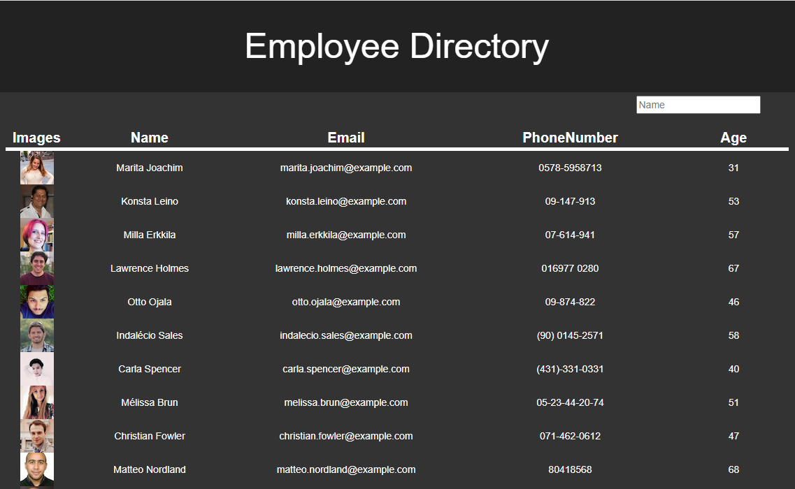
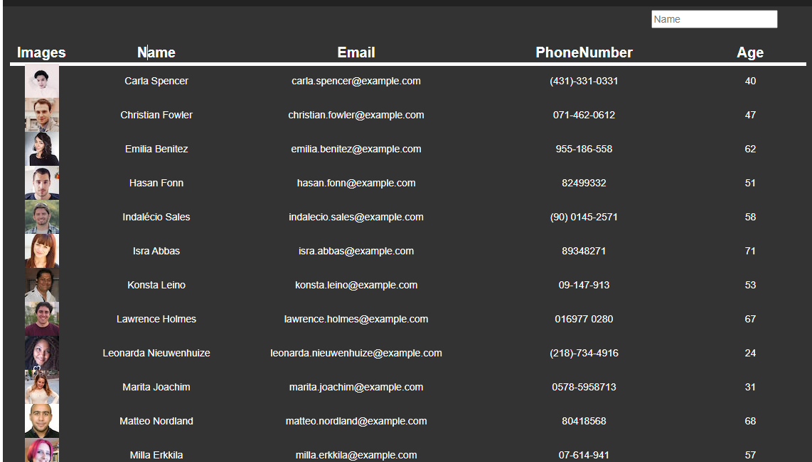

# Employee Directory

## Table of Contents

* [overview](#overview)
* [Links](#links)
* [Screenshots](#screenshots)
* [Installation](#installation)
* [Usage](#usage)
* [Technologies Used](#technologies)
* [Questions](#questions)

## overview

An employee Directory that lists employee information and can sort data by feild or by search bar filter. 

## Links

[See the Deployed Application](https://benimahat1291.github.io/EmployeeDirr/)

## Screenshots

## Installation Instructions

run "npm i" in the command line

## Usage

Uses Api from "https://randomuser.me/api/?results=20&?nat=us" to retrive random user information. Information is displayed on page. Each employee has an image, name, phonenumber, email, and age. If the header of the feild is selected employee list is ordered in ascending alphabetical or numerical order, and if clicked again employees are shown in desending order. If something is typed in the search bar, the name feild will be filtered to only include names that have the same characters as the search feild. 
 
Many application use tables that have these functionality. It is importand to be able to dynamicly view data in an era where there is so much of it. This will be a powerfull skill in my coding arsenal. 

## Technologies Used

React hooks, API, HTML, CSS, React

## Questions

If you have further projects and questions, you can find me on Github: [GITHUB](https://github.com/benimahat1291). 
please visit my portfolio to find contact information: [BENI MAHAT](https://benimahat1291.github.io/Portfolio_v2/#/). 
